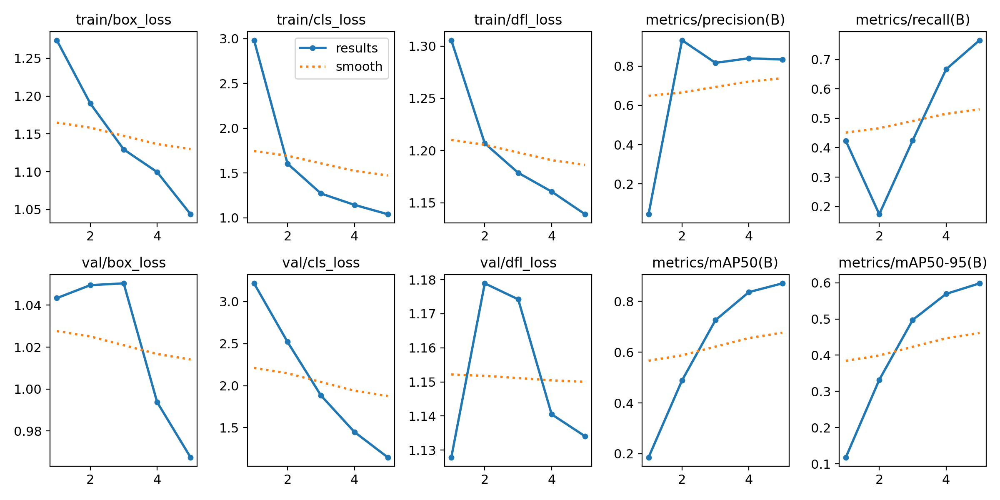
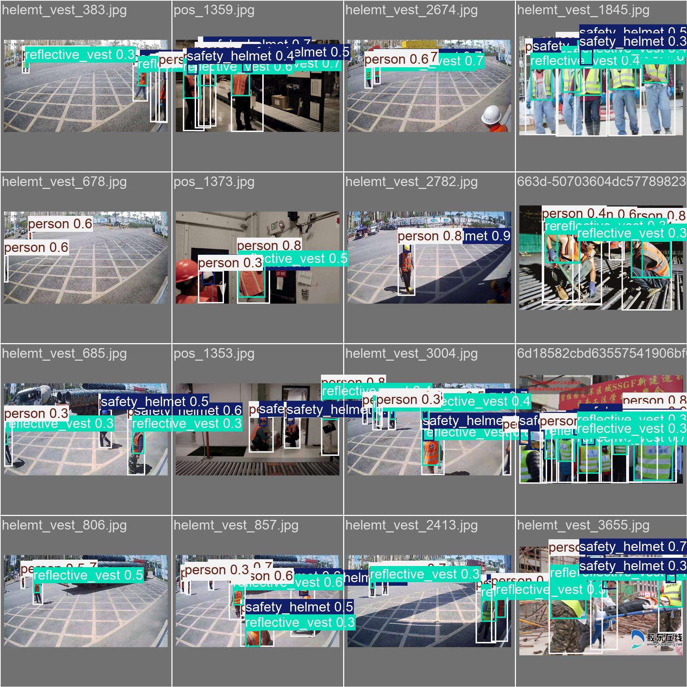

# safeyolo

[](https://github.com/ponm3ay/safeyolo/actions/workflows/ci.yml)


基于 [Ultralytics YOLO](https://docs.ultralytics.com/) 的**安全帽 / 反光衣佩戴检测**训练工具，覆盖从原始标注到模型部署的完整流程：

```
原始标注 (VOC / COCO / YOLO)
        │  safeyolo prepare   格式转换 + 划分 train/val/test
        ▼
dataset/  (images + labels + data.yaml)
        │  safeyolo train     训练 + 指标记录 + 权重归档
        ▼
runs/detect/<run>/weights/best.pt
        │  safeyolo val / test    评估        safeyolo predict    推理
        ▼
检测结果
```

## 项目结构

```
safeyolo/
├── configs/
│   └── train.yaml              # 训练超参数
├── dataset/                    # 数据集（已含划分与标注）
│   ├── data.yaml
│   ├── images/{train,val,test}/
│   └── labels/{train,val,test}/
├── docs/results/               # 训练结果示例图
├── src/safeyolo/
│   ├── cli.py                  # 统一命令行入口
│   ├── config.py               # 配置加载合并
│   ├── paths.py                # 项目路径解析（唯一来源）
│   ├── logging_setup.py        # 统一日志
│   ├── device.py               # 设备信息
│   ├── dataset/
│   │   ├── prepare.py          # 数据集准备器
│   │   ├── info.py             # 数据集统计
│   │   └── converters/         # COCO / VOC -> YOLO 转换
│   ├── training/trainer.py     # 训练器
│   └── validation/evaluator.py # 评估器 + 数据集健康检查
└── tests/                      # 单元测试（不依赖 torch，CI 秒级跑完）
```

## 数据集

安全帽佩戴检测数据集，共 **519 张**标注图片（415 train / 51 val / 53 test），5 个类别：

| 类别 | 说明 |
|---|---|
| `safety_helmet` | 安全帽 |
| `reflective_vest` | 反光衣 |
| `head` | 未戴帽的头部 |
| `ordinary_clothes` | 普通衣物 |
| `person` | 行人 |

## 安装

```bash
git clone https://github.com/ponm3ay/safeyolo.git
cd safeyolo
pip install -r requirements.txt
pip install -e . --no-deps    # 可选：安装 safeyolo 命令行
```

PyTorch 建议按官方指引安装对应 CUDA 版本：

```bash
pip install torch torchvision --index-url https://download.pytorch.org/whl/cu121
```

> 无 GPU 时把 `configs/train.yaml` 中的 `device: 0` 改为 `device: cpu`。

## 快速开始

所有功能通过统一 CLI 使用（`safeyolo xxx` 或 `python -m safeyolo xxx`）：

### 1. 准备数据集（可选，`dataset/` 已就绪）

当你使用自己的原始数据时才需要这一步。支持 Pascal VOC / COCO / YOLO 三种标注格式，可自动识别：

```bash
# 原始数据放入 raw/images（图片）与 raw/original_annotations（标注）
safeyolo prepare --format auto
# 或显式指定格式与划分比例
safeyolo prepare --format pascal_voc --train-rate 0.8 --valid-rate 0.1
```

输出：`dataset/{images,labels}/{train,val,test}` + `dataset/data.yaml`。

### 2. 数据集健康检查

```bash
safeyolo check    # 检查 nc/names 一致性、图片-标签配对、类别 id 与 bbox 有效性
safeyolo info     # 查看数据集统计
```

### 3. 训练

```bash
safeyolo train                          # 使用 configs/train.yaml 默认配置
safeyolo train --model yolo11 --epochs 200 --batch 32
safeyolo train --prepare --weights yolov8s.pt   # 训练前先重新准备数据
```

训练过程自动记录设备信息、参数与 mAP 指标（`logs/train/`），权重归档到 `models/checkpoints/`。

### 4. 评估

```bash
safeyolo val  --weights runs/detect/<run>/weights/best.pt
safeyolo test --weights models/checkpoints/<xxx>-best.pt
```

### 5. 推理

```bash
safeyolo predict --weights runs/detect/<run>/weights/best.pt --source image.jpg
safeyolo predict --weights best.pt --source video.mp4 --conf 0.4
```

### 其他

```bash
safeyolo devices   # 查看 CPU / 内存 / GPU 环境
```

## 训练结果示例

以下为 yolov8n 在本数据集上 100 epoch 的训练曲线示例（见图 `docs/results/`）：

| 训练指标 | 验证预测效果 |
|---|---|
|  |  |

## 配置说明

训练超参数集中在 [configs/train.yaml](configs/train.yaml)，命令行参数优先级更高：

| 参数 | 默认值 | 说明 |
|---|---|---|
| `model` | `yolov8` | 模型别名（yolov8 / yolo11），决定默认权重 |
| `weights` | `yolov8n.pt` | 预训练权重，放入 `models/pretrained/` 或自动下载 |
| `data` | `dataset/data.yaml` | 数据集配置 |
| `epochs` / `batch` / `imgsz` | `100 / 16 / 640` | 常规训练参数 |
| `device` | `0` | `0`、`0,1`、`cpu` |

## 开发

```bash
pip install pytest ruff pyyaml colorlog scikit-learn
pip install -e . --no-deps
ruff check src tests      # 代码检查
pytest tests -v           # 单元测试（无需 GPU / torch）
```

## 相对旧版本的改进

本项目由早期实训代码重构而来，主要变化：

- **可移植**：修复 data.yaml 硬编码 `C:\Users\...` 绝对路径与两处冲突的路径常量，路径统一由 `paths.py` 解析
- **结构清晰**：`yoloserver` 更名为 `safeyolo`，采用 `src/` 布局 + 统一 CLI，移除 `sys.path` hack 与重复实现（`setup_logging` 曾被完整复制一份）
- **功能补全**：实现旧版本空壳的 val / test 模式；yolov8 / yolo11 统一走 Ultralytics API，无需分支
- **仓库卫生**：移除误提交的 `__pycache__` / `.idea` / 日志 / 12 个重复 checkpoint（约 490MB），补齐 `.gitignore` / `requirements.txt` / 单元测试 / CI

## License

[MIT](./LICENSE) © 2026 [ponm3ay](https://github.com/ponm3ay)

## 致谢

- [Ultralytics YOLOv8](https://github.com/ultralytics/ultralytics)
- [Safety Helmet Detection 数据集](https://github.com/njvisionpower/Safety-Helmet-Wearing-Dataset)
